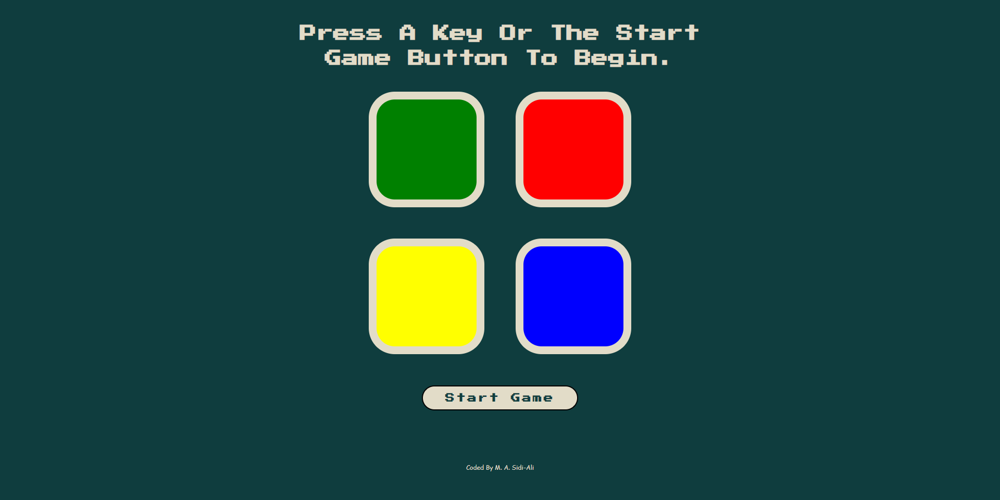
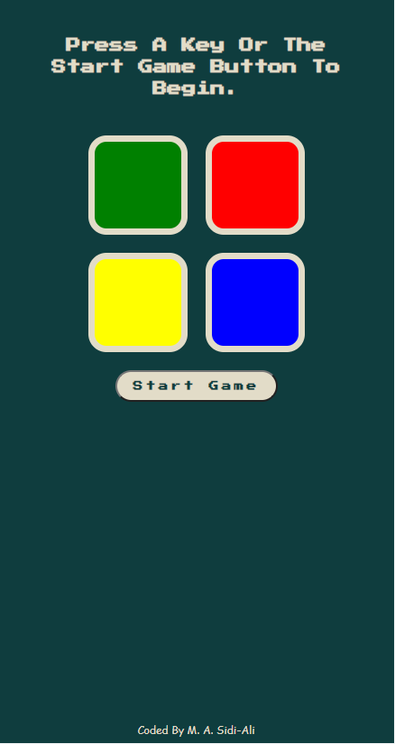

# Simon game.

## Table of contents

- [Overview](#overview)
  - [The project](#simon-game)
  - [Screenshot](#screenshot)
  - [Links](#links)
- [My process](#my-process)
  - [Built with](#built-with)
  - [What I learned](#what-i-learned)
  - [Continued development](#continued-development)
- [Author](#author)

## Overview

### The Simon Game
- This game is modelled off the game Simon. Users can press the start button or any key to start.
- The game will show users the tile they will have to click on.
- As they go from level to level, patterns get more and more complicated.
- When users get the pattern wrong, the game tells them it is game over and they can press any key or the restart button to start again.

### Screenshot

Below is a screenshot of the desktop version of the Simon Game.

Below is a screenshot of the mobile version of the Simon Game.

### Link

- Live Site URL: [Live Site](https://sidi-ali.github.io/simon3/)

## My process

I used a desktop-first workflow to complete this project.

### Built with

- HTML5
- CSS
- CSS Grid
- JavaScript
- DOM
- jQuery

### What I learned

Using advanced JavaScript and jQuery to select and manipulate elements.

### Continued development

I am going to continue learning advanced JavaScript and Unix Command Line.

## Author

- linkedin - [M. A. Sidi-Ali](https://www.linkedin.com/in/muhammad-adamu-sidi-ali-907a486b/)
